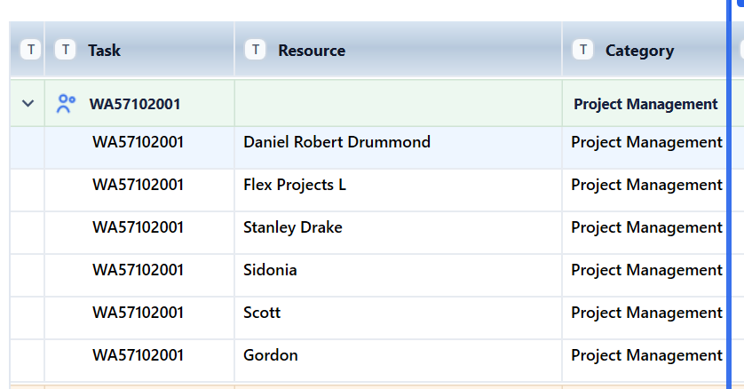

# Alpha 1.12 — Task Code and Category Editors

## Recommended Codex Settings

- Model: **Codex GPT-5.5**
- Reasoning: **high**
- Use the master spec for context, but implement only the tasks listed in this Alpha file.
- Do not implement tasks from other Alpha files unless required to satisfy the acceptance criteria here.

## Source Files to Read

- `../master/ProjectCostForecast_Master_Spec.md`
- `../images/image_index.md`
- This file: `alphas/Alpha_1_12_Task_Code_and_Category_Editors.md`

## Alpha Scope

| Task ID | Description Title | Complexity | Summary |
|---|---|---|---|
| SPEC-031 | Project task code editor | High | Right-clicking task-column content should offer Edit project task codes. The task-code editor is project-level, populated from raw data and user-created codes. Each task code has a system code and a task name. Raw-data task codes cannot be deleted or edited.… |
| SPEC-032 | Task name, category editor and grouped heading behaviour | High | Task codes have a System Code and user-editable Task Name. When grouped by task code, the group heading shows the system task code in the Task column and the Task Name in the Resource column. If no Task Name exists, show Unnamed task, with Unnamed task (1), e… |

## Out of Scope

- Any task not listed in the Alpha Scope table.
- Major architecture changes unless the Alpha Scope explicitly contains GRID architecture tasks.
- Business-rule changes not described in the included requirements or acceptance criteria.

## Screenshots / Visual References

### SPEC-032 — Task code group heading layout: task code in Task column, task name in Resource column, category in Category column.

## Detailed Requirements

### SPEC-031. Project task code editor — Alpha 1.12
Origin: Original CTC item 25 | Status: Active
**Requirement**
Right-clicking task-column content should offer Edit project task codes. The task-code editor is project-level, populated from raw data and user-created codes. Each task code has a system code and a task name. Raw-data task codes cannot be deleted or edited. Manually added task codes can be edited until raw data later uses the same code, at which point they become non-editable. Manually added codes are allowed even before raw data exists. Changes update existing forecast rows immediately.
**Acceptance criteria**
- Right-click task-code cell shows Edit project task codes.
- Editor lists raw-data task codes and manually added project task codes.
- Raw-data codes cannot be deleted and their code value cannot be edited.
- Manual codes can be added above/below and edited until raw data uses them.
- Duplicate attempted task names are handled with a (1) style suffix on the name and a duplicate-warning message.
- Editor allows visual drag/drop reorder and A-Z sort, but order affects only the editor view.
- Existing forecast rows update immediately when task name/code metadata changes.
**Decisions captured from Stan's answers**
- Task codes are stored at project level.
- User cannot delete task codes that are used by raw data.
- Visual order only; no reporting effect.
- Duplicate suffix is applied to the task name, not the system task code.

### SPEC-032. Task name, category editor and grouped heading behaviour — Alpha 1.12
Origin: Original CTC item 26 plus later rewrite | Status: Active
**Requirement**
Task codes have a System Code and user-editable Task Name. When grouped by task code, the group heading shows the system task code in the Task column and the Task Name in the Resource column. If no Task Name exists, show Unnamed task, with Unnamed task (1), etc. for duplicates. Entering a Task Name creates a matching project Category if needed and uses Task Name as the default category. Users can override Category at row level by typing directly in the Category cell; the cell should autocomplete existing project categories or create a new category by typed text. Category names are project-specific and managed in a Category Name Editor. Task Code Editor and Category Name Editor are the same popup with different tabs, opening to the relevant tab depending on trigger.
**Acceptance criteria**
- Grouped-by-task row displays task code in Task column and Task Name in Resource column.
- Category column shows the row-level Reporting Category.
- Task Name is default category when no row-level override exists.
- Row-level category override takes priority over default Task Name category.
- User can type category directly in grid with autocomplete/dropdown and create new category by typing.
- Raw imported task codes appear in Task Code Editor but do not create categories until user enters Task Name or Category.
- Category editor supports rename, delete, merge, colour and icon; active/inactive is future.
- Deleting a category that is in use clears row-level category overrides that use that category and returns affected rows to their default Task Name category.
- Reports, pivots, filters and group summaries default to Task Name but let the user choose Category where applicable.
- Task code group header icon remains and is linked to the task code.
- Category group headers show category only with resource/forecast lines beneath.
**Decisions captured from Stan's answers**
- Category is project-specific.
- Category override is row-level.
- Changing Task Name updates only rows that have no manual category override.
- Changing a category name updates rows currently using that category.
- Multiple task codes do not share category through task code relationship; category is simply a row/reporting field.
- Category active/inactive and used-count are future features.
- Deleting an in-use category clears overrides and removes the category relationship rather than blocking deletion.

## Required Smoke Tests

- Run the acceptance criteria for every task in this Alpha.
- Confirm no unrelated UI workflows are changed.
- Confirm project open/save still works after changes, where applicable.
- Confirm no new build errors are introduced.
- For grid-related Alphas, test resize, selection, copy/paste, right-click menu, and locked/read-only behaviour where applicable.

## Codex Guardrails

- Preserve existing working behaviour unless this Alpha explicitly changes it.
- Do not rename public user-facing concepts unless the requirement says to.
- Do not silently change calculation, period, save/load, or import behaviour outside the included tasks.
- If implementation requires a broader refactor, keep the visible behaviour equivalent and document the reason in the commit/summary.