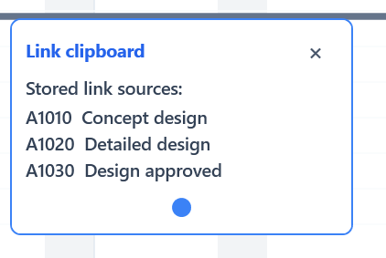
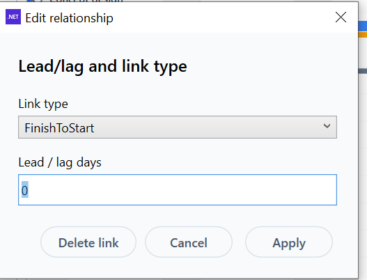

# Alpha 1.19 — Schedule Selection, Links and Lead/Lag

## Recommended Codex Settings

- Model: **Codex GPT-5.5**
- Reasoning: **high**
- Use the master spec for context, but implement only the tasks listed in this Alpha file.
- Do not implement tasks from other Alpha files unless required to satisfy the acceptance criteria here.

## Source Files to Read

- `../master/ProjectCostForecast_Master_Spec.md`
- `../images/image_index.md`
- This file: `alphas/Alpha_1_19_Schedule_Selection_Links_and_Lead_Lag.md`

## Alpha Scope

| Task ID | Description Title | Complexity | Summary |
|---|---|---|---|
| SPEC-006 | Schedule row selection, active row and Gantt selection sync | High | Schedule rows must select visibly and reliably. Clicking a row makes it the active row. Ctrl+click adds/removes rows from the selection. Clicking a Gantt bar selects the linked schedule row. Selected rows must remain selected while scrolling and must be usabl… |
| SPEC-008 | Schedule link clipboard supports repeated source entries and safe linking | High | The schedule link clipboard must allow the same source activity to be added more than once as separate clipboard entries so it can be linked to separate target tasks. Each used clipboard entry is removed after a link is made while other entries remain. Duplic… |
| SPEC-009 | Lead/lag adjustment arrow controls in link editor | High | Lead/lag adjustment in the schedule link editor popup must provide up/down arrow controls and keyboard up/down support. Each click adjusts by one working day based on the activity calendar. Holding the arrow repeats slowly at first, then faster. Negative valu… |
| EXCEL-015 | Schedule grid follows Excel-like selection model | High | Schedule grid should use the same Excel-like selection principles with activity-row context, visible selection, multi-row selection and Gantt sync. |

## Out of Scope

- Any task not listed in the Alpha Scope table.
- Major architecture changes unless the Alpha Scope explicitly contains GRID architecture tasks.
- Business-rule changes not described in the included requirements or acceptance criteria.

## Screenshots / Visual References

### SPEC-008 — Schedule link clipboard popover showing stored link sources.

### SPEC-009 — Schedule relationship editor with lead/lag field requiring arrow controls.

## Detailed Requirements

### SPEC-006. Schedule row selection, active row and Gantt selection sync — Alpha 1.19
Origin: Original item 8 / P08; EXCEL-015 overlap | Status: Active
**Requirement**
Schedule rows must select visibly and reliably. Clicking a row makes it the active row. Ctrl+click adds/removes rows from the selection. Clicking a Gantt bar selects the linked schedule row. Selected rows must remain selected while scrolling and must be usable by row commands.
**Acceptance criteria**
- Clicking a schedule row visibly selects it and sets the active row.
- Ctrl+click supports multi-row selection.
- Gantt bar click selects the corresponding row.
- Selection remains visible and stable when scrolling vertically or horizontally.
- Delete, indent, outdent, link, copy, paste and cut commands use the selected rows where applicable.
- The active row feeds the future Activity detail panel.
**Decisions captured from Stan's answers**
- The immediate bug is the selected-row highlight not showing.
- Gantt bar selection should sync with the grid.
- Multi-row support is required.

### SPEC-008. Schedule link clipboard supports repeated source entries and safe linking — Alpha 1.19
Origin: Original item 10 / P10; EXCEL-016 overlap | Status: Active
**Requirement**
The schedule link clipboard must allow the same source activity to be added more than once as separate clipboard entries so it can be linked to separate target tasks. Each used clipboard entry is removed after a link is made while other entries remain. Duplicate identical links are ignored. Circular links are not allowed and must warn the user.
**Acceptance criteria**
- The same source activity can appear multiple times in the link clipboard as separate entries.
- Using one clipboard entry to create a link removes only that entry.
- Remaining entries stay available for other links.
- Duplicate identical links are ignored.
- Circular dependency attempts show a warning popup and do not create the link.
**Decisions captured from Stan's answers**
- One link entry can be used once and is removed after use.
- Multiple source activities and repeated same-activity entries are allowed.
- Applying the same type/lag to all targets is not relevant.

### SPEC-009. Lead/lag adjustment arrow controls in link editor — Alpha 1.19
Origin: Original item 11 / P11 | Status: Active
**Requirement**
Lead/lag adjustment in the schedule link editor popup must provide up/down arrow controls and keyboard up/down support. Each click adjusts by one working day based on the activity calendar. Holding the arrow repeats slowly at first, then faster. Negative values represent lead and positive values represent lag, matching MS Project-style behaviour.
**Acceptance criteria**
- Lead/lag field in the link editor popup has usable up/down controls.
- Each click changes lag by one working day based on the activity calendar.
- Holding an arrow repeats the adjustment with acceleration.
- Keyboard up/down also adjusts the value.
- No minimum or maximum limit is imposed unless required by schedule validation.
- Schedule recalculates and link visuals update after changes.
**Decisions captured from Stan's answers**
- Arrow controls are only required in the link editor popup.
- Negative values are lead, positive values are lag.

### EXCEL-015. Schedule grid follows Excel-like selection model — Alpha 1.19
Origin: Excel-style grid behaviour standard | Status: Active
**Requirement**
Schedule grid should use the same Excel-like selection principles with activity-row context, visible selection, multi-row selection and Gantt sync.
**Acceptance criteria**
- EXCEL-015-AC1: Behaviour is testable from the UI and consistent across all in-scope grids unless a documented exception exists. — Alpha 1.19
# 5. Grid performance and reusable architecture tasks
These tasks are kept separate from normal SPEC numbering. They cover grid performance, shared grid controls, reusable UI controls and anti-duplication architecture rules.

## Required Smoke Tests

- Run the acceptance criteria for every task in this Alpha.
- Confirm no unrelated UI workflows are changed.
- Confirm project open/save still works after changes, where applicable.
- Confirm no new build errors are introduced.
- For grid-related Alphas, test resize, selection, copy/paste, right-click menu, and locked/read-only behaviour where applicable.

## Codex Guardrails

- Preserve existing working behaviour unless this Alpha explicitly changes it.
- Do not rename public user-facing concepts unless the requirement says to.
- Do not silently change calculation, period, save/load, or import behaviour outside the included tasks.
- If implementation requires a broader refactor, keep the visible behaviour equivalent and document the reason in the commit/summary.