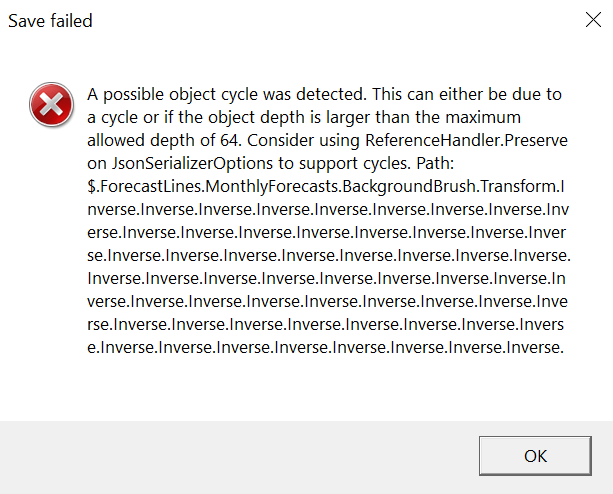
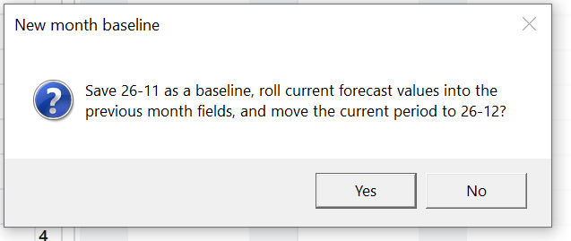
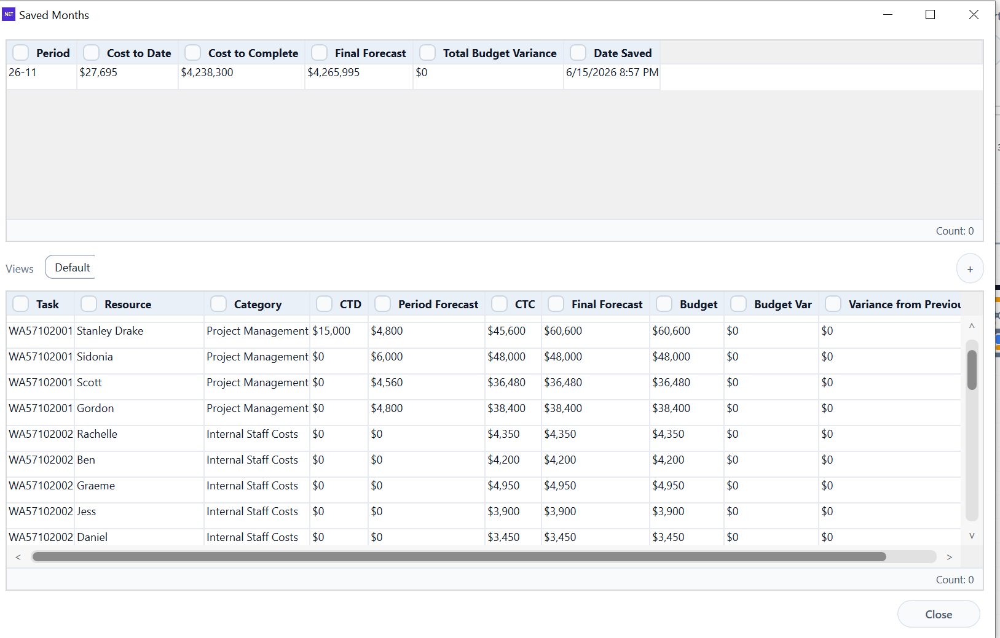

# Alpha 1.1 — Forecast Calculation, Period Warning and Save Trust

## Recommended Codex Settings

- Model: **Codex GPT-5.5**
- Reasoning: **high**
- Use the master spec for context, but implement only the tasks listed in this Alpha file.
- Do not implement tasks from other Alpha files unless required to satisfy the acceptance criteria here.

## Source Files to Read

- `../master/ProjectCostForecast_Master_Spec.md`
- `../images/image_index.md`
- This file: `alphas/Alpha_1_1_Forecast_Calculation_Period_Warning_and_Save_Trust.md`

## Alpha Scope

| Task ID | Description Title | Complexity | Summary |
|---|---|---|---|
| SPEC-003 | Forecast Delete key recalculation and save defect | High | Deleting or clearing a user-entered forecast month value must immediately recalculate all dependent values. Blank forecast cells must calculate as zero. The Delete-key path must commit and recalculate the same way as typing zero and leaving the cell. Add and… |
| SPEC-010 | Current period dropdown and month-roll workflow | High | The current period dropdown should provide a clear new-month workflow using the existing month close controls where available. New month creates/saves a month snapshot and rolls the active period forward by one. Viewing an old month remains based on saved sna… |
| SPEC-015 | Compact red warning bar for current active period mismatch | High | Replace the legacy dropdown/reset area under the forecast views with a compact warning bar about 70 percent of the current height. Remove the two legacy filter dropdowns and reset button. The warning bar must show non-dismissible red warnings when the saved c… |
| SPEC-053 | Saved CurrentPeriod authority and no silent auto-overwrite | High | The app must not silently overwrite the saved project CurrentPeriod based only on DateTime/PC date. Opening any project uses the saved CurrentPeriod for locks, current-month actuals, reports and snapshots. The app may calculate expected period from PC date fo… |

## Out of Scope

- Any task not listed in the Alpha Scope table.
- Major architecture changes unless the Alpha Scope explicitly contains GRID architecture tasks.
- Business-rule changes not described in the included requirements or acceptance criteria.

## Screenshots / Visual References

### SPEC-003 — Save failed error dialog related to forecast delete/save defect.

### SPEC-010 — New month baseline confirmation dialog for period rollover workflow.

### SPEC-010 — Saved month / old month popout view showing locked previous forecast style.

## Detailed Requirements

### SPEC-003. Forecast Delete key recalculation and save defect — Alpha 1.1
Origin: Original items 4 and 16 / P04 | Status: Active
**Requirement**
Deleting or clearing a user-entered forecast month value must immediately recalculate all dependent values. Blank forecast cells must calculate as zero. The Delete-key path must commit and recalculate the same way as typing zero and leaving the cell. Add and investigate the related save/persistence bug reported during testing.
**Acceptance criteria**
- Pressing Delete on a user-entered forecast month amount immediately updates CTC, FCC, month forecast variance, last-month variance, budget variance, total budget variance, group totals, category summaries, pivots and reports where applicable.
- Blank forecast month cells calculate as zero.
- Deleting a value and then saving/reopening preserves the cleared value and recalculated totals.
- Multi-cell Delete operations recalculate once after the batch edit.
- Locked months block deletion before recalculation.
**Decisions captured from Stan's answers**
- The deleted value was a user-entered monthly forecast amount, not a calculated field.
- All variance fields should update.
- Immediate recalculation is desired if performance remains acceptable.
- Original item 16 was removed as a duplicate and merged here.

### SPEC-010. Current period dropdown and month-roll workflow — Alpha 1.1
Origin: Original header item 1 | Status: Active
**Requirement**
The current period dropdown should provide a clear new-month workflow using the existing month close controls where available. New month creates/saves a month snapshot and rolls the active period forward by one. Viewing an old month remains based on saved snapshots and should open locked historical data rather than silently changing the active project period.
**Acceptance criteria**
- Dropdown clearly exposes the new-month workflow without silently changing data.
- New month creates a snapshot, saves it and rolls forward one period.
- The rolled-forward period uses current values as the new previous values for variance reference.
- Saved snapshots only are used for old-month viewing.
- Old-month popout data is locked and watermarked as previous forecast locked for editing.
- A future unlock-open-saved-month action is recorded for the saved-month tab.
**Decisions captured from Stan's answers**
- Existing new-month control is mostly correct and should be reused.
- Old-month viewing already exists under View Saved Month in the left panel.
- Old months are saved snapshots only.

### SPEC-015. Compact red warning bar for current active period mismatch — Alpha 1.1
Origin: Original forecast tab item 6; items 30/31 warning overlap | Status: Active
**Requirement**
Replace the legacy dropdown/reset area under the forecast views with a compact warning bar about 70 percent of the current height. Remove the two legacy filter dropdowns and reset button. The warning bar must show non-dismissible red warnings when the saved current active period is not the expected working period based on the PC calendar. July is FY01 of the next FY year; users normally work one month behind. If the PC month is June/FY11, FY10 is acceptable, FY9 or lower is a warning, and FY11/FY12 are warnings. The warning should not appear when viewing an older saved month snapshot. If multiple warnings are active, the bar shows all active warnings and expands downward as needed.
**Acceptance criteria**
- Legacy dropdowns and reset button are removed.
- Warning bar is around 70 percent of current height.
- Warning compares against PC calendar month and saved project active period.
- No warning appears for the accepted previous-month working period.
- Warnings appear when the project is too old, current month or future month.
- Warning text is red and non-dismissible.
- All active warnings are shown.
- Warning bar expands downward to fit multiple warnings.
- Warning does not appear when viewing a locked old saved month.
**Decisions captured from Stan's answers**
- Suggested warning text: Current active period is incorrect; please save and create a new month.
- Warning severity does not vary.
- Warning appears in the warning bar, not in the header current-period area.
- Warnings should feed a future warning tab/list.
- The bar shows all active warnings and expands downward to fit them.

### SPEC-053. Saved CurrentPeriod authority and no silent auto-overwrite — Alpha 1.1
Origin: Original ChatGPT items 30 and 31 | Status: Active
**Requirement**
The app must not silently overwrite the saved project CurrentPeriod based only on DateTime/PC date. Opening any project uses the saved CurrentPeriod for locks, current-month actuals, reports and snapshots. The app may calculate expected period from PC date for warnings only. Changing CurrentPeriod happens only through explicit user workflows such as month rollover. The month-rollover popup should confirm that the user is ready to save the project file and set up a new month. Imported raw data must never advance CurrentPeriod automatically.
**Acceptance criteria**
- Opening an old project does not change saved CurrentPeriod.
- Warnings may appear but no period changes occur without user action.
- All period-sensitive behaviour uses saved/confirmed CurrentPeriod.
- New blank, sample and imported projects all follow the rule.
- Raw data period values are ignored for period advancement until user performs next-month workflow.
- Month rollover confirmation asks the user to confirm they are ready to save the project file and set up a new month.
- If saved CurrentPeriod is not found, show a warning.
**Decisions captured from Stan's answers**
- Merge original items 30 and 31.
- Warning appears in warning bar.
- Month-close snapshots are read-only when viewed from old months.
- Separate viewing period is a future feature.
- Rollover popup text/action: confirm you are ready to save the project file and set up a new month.

## Required Smoke Tests

- Run the acceptance criteria for every task in this Alpha.
- Confirm no unrelated UI workflows are changed.
- Confirm project open/save still works after changes, where applicable.
- Confirm no new build errors are introduced.
- For grid-related Alphas, test resize, selection, copy/paste, right-click menu, and locked/read-only behaviour where applicable.

## Codex Guardrails

- Preserve existing working behaviour unless this Alpha explicitly changes it.
- Do not rename public user-facing concepts unless the requirement says to.
- Do not silently change calculation, period, save/load, or import behaviour outside the included tasks.
- If implementation requires a broader refactor, keep the visible behaviour equivalent and document the reason in the commit/summary.