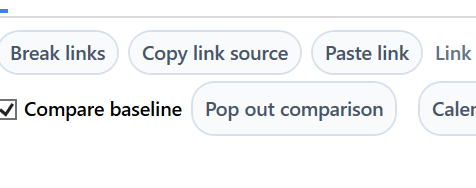

# Alpha 1.20 — Schedule Comparison, Gantt Sizing and Activity Panel

## Recommended Codex Settings

- Model: **Codex GPT-5.5**
- Reasoning: **high**
- Use the master spec for context, but implement only the tasks listed in this Alpha file.
- Do not implement tasks from other Alpha files unless required to satisfy the acceptance criteria here.

## Source Files to Read

- `../master/ProjectCostForecast_Master_Spec.md`
- `../images/image_index.md`
- This file: `alphas/Alpha_1_20_Schedule_Comparison_Gantt_Sizing_and_Activity_Panel.md`

## Alpha Scope

| Task ID | Description Title | Complexity | Summary |
|---|---|---|---|
| SPEC-007 | Baseline comparison opens as non-blocking schedule window | High | The Baseline Comparison button must not freeze the app. It should open a separate non-blocking window that displays the same schedule-style view broken out from the main window. This is intended so another version of the programme can be opened alongside it l… |
| SPEC-051 | Schedule Gantt bar and baseline sizing | High | Normal and critical path task bars in the schedule/Gantt view should be slightly larger. Baseline indicators should be slightly smaller and shown as slightly grey thick lines so they remain secondary to the current schedule bars. Milestones and summary bars a… |
| SPEC-052 | Schedule Activity button and editable Activity panel | High | In the Schedule context, replace the generic Detail button with an Activity button visible all the time. The user chooses when it is open or closed. If no activity is selected and the Activity panel is opened, it shows an empty state. When an activity is sele… |

## Out of Scope

- Any task not listed in the Alpha Scope table.
- Major architecture changes unless the Alpha Scope explicitly contains GRID architecture tasks.
- Business-rule changes not described in the included requirements or acceptance criteria.

## Screenshots / Visual References

### SPEC-007 — Schedule toolbar/button area including Baseline Comparison.

## Detailed Requirements

### SPEC-007. Baseline comparison opens as non-blocking schedule window — Alpha 1.20
Origin: Original item 9 / P09 | Status: Active
**Requirement**
The Baseline Comparison button must not freeze the app. It should open a separate non-blocking window that displays the same schedule-style view broken out from the main window. This is intended so another version of the programme can be opened alongside it later.
**Acceptance criteria**
- Clicking Baseline Comparison opens a separate non-blocking window.
- The main app remains movable and interactive after the comparison window is visible.
- The app does not require force-close on a small schedule of around 15 activities.
- The comparison window gives clear feedback if comparison/baseline data is missing.
**Decisions captured from Stan's answers**
- The freezing control is the Baseline Comparison button.
- Freeze occurs after the popup is visible and currently requires force close.
- Window should be separate and non-blocking.

### SPEC-051. Schedule Gantt bar and baseline sizing — Alpha 1.20
Origin: Added SCH-N01 | Status: Active
**Requirement**
Normal and critical path task bars in the schedule/Gantt view should be slightly larger. Baseline indicators should be slightly smaller and shown as slightly grey thick lines so they remain secondary to the current schedule bars. Milestones and summary bars are not affected unless their existing style requires alignment cleanup.
**Acceptance criteria**
- Normal and critical path task bars are slightly larger.
- Baseline indicators are slightly smaller than current bars.
- Baseline indicators appear as slightly grey thick lines.
- Date alignment remains correct.
- Milestones/summary bars are not unintentionally changed.
**Decisions captured from Stan's answers**
- Only normal tasks and critical path tasks.

### SPEC-052. Schedule Activity button and editable Activity panel — Alpha 1.20
Origin: Added SCH-N02 to SCH-N04 | Status: Active
**Requirement**
In the Schedule context, replace the generic Detail button with an Activity button visible all the time. The user chooses when it is open or closed. If no activity is selected and the Activity panel is opened, it shows an empty state. When an activity is selected, the Activity panel shows one selected activity only and all supported activity information: activity number, name, dates, duration, predecessors, successors, calendar, imposed dates/constraints, baseline/progress and other supported schedule properties. Any field editable in the main schedule window is editable here and changes reflect both ways immediately. Predecessor and successor tables use the shared grid control, allow add/delete, and invalid links/constraints show inline validation before recalculation.
**Acceptance criteria**
- Schedule shows Activity button instead of Detail button.
- Activity button is always visible in schedule context.
- Opening Activity with no selected activity shows an empty state.
- Panel supports one selected activity only.
- All main-window editable fields can be edited in Activity panel.
- Changes update schedule table and Gantt immediately.
- Predecessor/successor tables use shared grid control.
- User can add/delete predecessor and successor links.
- Invalid links/constraints show inline validation before schedule recalculation.
**Decisions captured from Stan's answers**
- Resource drilldown collapses when entering Schedule; Activity panel is the detail mechanism.
- No Apply/Save button; immediate updates.
- No selected activity shows empty state.

## Required Smoke Tests

- Run the acceptance criteria for every task in this Alpha.
- Confirm no unrelated UI workflows are changed.
- Confirm project open/save still works after changes, where applicable.
- Confirm no new build errors are introduced.
- For grid-related Alphas, test resize, selection, copy/paste, right-click menu, and locked/read-only behaviour where applicable.

## Codex Guardrails

- Preserve existing working behaviour unless this Alpha explicitly changes it.
- Do not rename public user-facing concepts unless the requirement says to.
- Do not silently change calculation, period, save/load, or import behaviour outside the included tasks.
- If implementation requires a broader refactor, keep the visible behaviour equivalent and document the reason in the commit/summary.