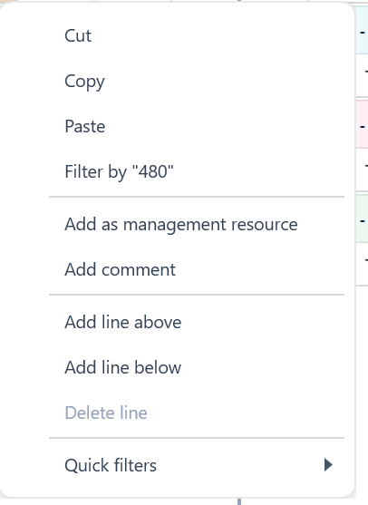

# Alpha 1.5 — Excel-Style Grid Interaction Core

## Recommended Codex Settings

- Model: **Codex GPT-5.4**
- Reasoning: **high**
- Use the master spec for context, but implement only the tasks listed in this Alpha file.
- Do not implement tasks from other Alpha files unless required to satisfy the acceptance criteria here.

## Source Files to Read

- `../master/ProjectCostForecast_Master_Spec.md`
- `../images/image_index.md`
- This file: `alphas/Alpha_1_5_Excel_Style_Grid_Interaction_Core.md`

## Alpha Scope

| Task ID | Description Title | Complexity | Summary |
|---|---|---|---|
| SPEC-005 | Right-click any normal CTC row cell to Add as management task | Medium-High | Right-clicking any cell in an eligible normal CTC forecast row must expose the existing Add as management task action. The action must not depend on right-clicking only the forecast/month area. |
| EXCEL-001 | Global Excel-style grid standard | Medium-High | All editable and read-only grids should behave consistently like an Excel-style spreadsheet unless a documented exception exists. Stan clarified all grids should be Excel-like, including schedule where practical. |
| EXCEL-002 | Single-click active cell, typing overwrite and F2/double-click edit | Medium-High | Single click selects/activates only. Typing replaces the current value. Double-click or F2 edits inside the value. |
| EXCEL-003 | Standard keyboard navigation | Medium-High | Arrow, Enter, Shift+Enter, Tab, Shift+Tab, Esc, Delete, Backspace, Ctrl+C/X/V/A, Home/End and F2 should behave consistently where applicable. |
| EXCEL-004 | Active row, range selection and Alt-hover temporary active cell | Medium-High | First click sets the active row/cell; active row feeds forecast/resource/schedule side panels. Shift/Ctrl/click-drag selection should work. Preserve existing Alt-hover behaviour: while Alt is held, hovering updates the detail panel only as a temporary active… |
| EXCEL-011 | Active cell/range visual state | Medium-High | Active cell, active row, selected range, current row, locked, read-only and calculated cells must have distinct visual states. |

## Out of Scope

- Any task not listed in the Alpha Scope table.
- Major architecture changes unless the Alpha Scope explicitly contains GRID architecture tasks.
- Business-rule changes not described in the included requirements or acceptance criteria.

## Screenshots / Visual References

### SPEC-005 — CTC row right-click menu showing Add as management task only in limited areas.

## Detailed Requirements

### SPEC-005. Right-click any normal CTC row cell to Add as management task — Alpha 1.5
Origin: Original item 6 / P06; EXCEL-012 overlap | Status: Active
**Requirement**
Right-clicking any cell in an eligible normal CTC forecast row must expose the existing Add as management task action. The action must not depend on right-clicking only the forecast/month area.
**Acceptance criteria**
- Right-clicking task, resource, category or forecast cells in a normal CTC row shows Add as management task when eligible.
- The created/linked management task uses the correct row context.
- Group/header rows do not show this action.
- If already linked, the menu item is disabled and displays Add as management task (already added).
- Locked/closed month cells still allow this row-level action.
**Decisions captured from Stan's answers**
- Action label already exists as Add as management task.
- Scope is only normal CTC forecast rows.

### EXCEL-001. Global Excel-style grid standard — Alpha 1.5
Origin: Excel-style grid behaviour standard | Status: Active
**Requirement**
All editable and read-only grids should behave consistently like an Excel-style spreadsheet unless a documented exception exists. Stan clarified all grids should be Excel-like, including schedule where practical.
**Acceptance criteria**
- EXCEL-001-AC1: Behaviour is testable from the UI and consistent across all in-scope grids unless a documented exception exists. — Alpha 1.5

### EXCEL-002. Single-click active cell, typing overwrite and F2/double-click edit — Alpha 1.5
Origin: Excel-style grid behaviour standard | Status: Active
**Requirement**
Single click selects/activates only. Typing replaces the current value. Double-click or F2 edits inside the value.
**Acceptance criteria**
- EXCEL-002-AC1: Behaviour is testable from the UI and consistent across all in-scope grids unless a documented exception exists. — Alpha 1.5

### EXCEL-003. Standard keyboard navigation — Alpha 1.5
Origin: Excel-style grid behaviour standard | Status: Active
**Requirement**
Arrow, Enter, Shift+Enter, Tab, Shift+Tab, Esc, Delete, Backspace, Ctrl+C/X/V/A, Home/End and F2 should behave consistently where applicable.
**Acceptance criteria**
- EXCEL-003-AC1: Behaviour is testable from the UI and consistent across all in-scope grids unless a documented exception exists. — Alpha 1.5

### EXCEL-004. Active row, range selection and Alt-hover temporary active cell — Alpha 1.5
Origin: Excel-style grid behaviour standard | Status: Active
**Requirement**
First click sets the active row/cell; active row feeds forecast/resource/schedule side panels. Shift/Ctrl/click-drag selection should work. Preserve existing Alt-hover behaviour: while Alt is held, hovering updates the detail panel only as a temporary active context; releasing Alt restores the previous active row/cell.
**Acceptance criteria**
- EXCEL-004-AC1: Behaviour is testable from the UI and consistent across all in-scope grids unless a documented exception exists. — Alpha 1.5

### EXCEL-011. Active cell/range visual state — Alpha 1.5
Origin: Excel-style grid behaviour standard | Status: Active
**Requirement**
Active cell, active row, selected range, current row, locked, read-only and calculated cells must have distinct visual states.
**Acceptance criteria**
- EXCEL-011-AC1: Behaviour is testable from the UI and consistent across all in-scope grids unless a documented exception exists. — Alpha 1.5

## Required Smoke Tests

- Run the acceptance criteria for every task in this Alpha.
- Confirm no unrelated UI workflows are changed.
- Confirm project open/save still works after changes, where applicable.
- Confirm no new build errors are introduced.
- For grid-related Alphas, test resize, selection, copy/paste, right-click menu, and locked/read-only behaviour where applicable.

## Codex Guardrails

- Preserve existing working behaviour unless this Alpha explicitly changes it.
- Do not rename public user-facing concepts unless the requirement says to.
- Do not silently change calculation, period, save/load, or import behaviour outside the included tasks.
- If implementation requires a broader refactor, keep the visible behaviour equivalent and document the reason in the commit/summary.