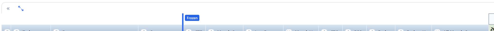
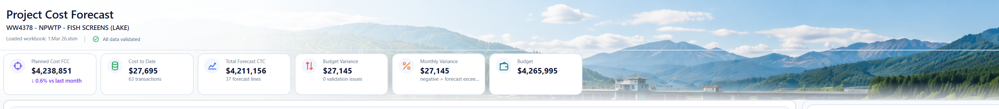
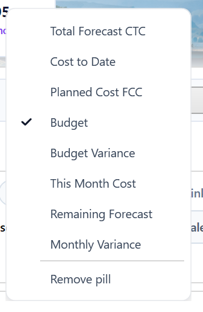
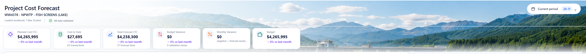

# Alpha 1.8 — Basic Header Visual Cleanup

## Recommended Codex Settings

- Model: **Codex GPT-5.3**
- Reasoning: **medium**
- Use the master spec for context, but implement only the tasks listed in this Alpha file.
- Do not implement tasks from other Alpha files unless required to satisfy the acceptance criteria here.

## Source Files to Read

- `../master/ProjectCostForecast_Master_Spec.md`
- `../images/image_index.md`
- This file: `alphas/Alpha_1_8_Basic_Header_Visual_Cleanup.md`

## Alpha Scope

| Task ID | Description Title | Complexity | Summary |
|---|---|---|---|
| SPEC-001 | Grid body text one size smaller than headers | Medium | All grid body/content text across every tab must render one font-size step smaller than the related grid/header text. Popup windows, mapping dialogs, context menus, tooltips and validation panels are out of scope for this font reduction. |
| SPEC-002 | Header-band expand/collapse icon and border fix | Medium | The forecast header-band expand/collapse control must move directly down one row into the year/header line. Replace the two separate expand/collapse icons with one state-changing icon. The header border must draw continuously with no gap on the left border. |
| SPEC-004 | Header image seam/border removal | Medium | The top heading picture must appear as one continuous image background across the full header area, with no visible line, seam or border cutting through it. There should be no border around the heading image area. |
| SPEC-011 | KPI pill context menu and user preference state | Medium | Right-clicking a KPI pill or blank KPI pill strip area must show a useful KPI pill management menu. The old generic add-pill action should be removed. The menu must list all available KPI pills with ticks beside active ones so hidden/inactive pills can be re-… |
| SPEC-012 | Header gradient layering must not blur UI | Medium | The page/header gradient must remain behind the header image and UI elements. It must not draw over or blur KPI pills, icons, controls or the top of the resource drilldown panel/border. |
| SPEC-014 | Current period dropdown arrow visual style | Medium | The current period dropdown arrow shape must match the dropdown arrows used in forecast tab headers and the app’s modern right-click menu style. It should not rotate when opened. |

## Out of Scope

- Any task not listed in the Alpha Scope table.
- Major architecture changes unless the Alpha Scope explicitly contains GRID architecture tasks.
- Business-rule changes not described in the included requirements or acceptance criteria.

## Screenshots / Visual References

### SPEC-002 — Header band expand/collapse icon placement and incomplete border/gap issue.

### SPEC-004 — Header image seam/border line cutting through the heading picture.

### SPEC-011 — Header KPI pill strip referenced by pill menu requirements.

### SPEC-011 — KPI pill context menu showing active/hidden pill options.

### SPEC-012 — Header gradient/overlay area where gradient appears over UI elements.

## Detailed Requirements

### SPEC-001. Grid body text one size smaller than headers — Alpha 1.8
Origin: Original item 2 / P02 | Status: Active
**Requirement**
All grid body/content text across every tab must render one font-size step smaller than the related grid/header text. Popup windows, mapping dialogs, context menus, tooltips and validation panels are out of scope for this font reduction.
**Acceptance criteria**
- All grid body cells use header font size minus one step.
- Currency and numeric cells use the smaller body size.
- Grid row heights reduce to suit the smaller font without clipping.
- Header rows, tab labels, buttons and app title/header text are not unintentionally reduced.
**Decisions captured from Stan's answers**
- Scope is every tab, but only grid/content text below headers.
- Popup/dialog/menu/tooltip/validation panel body fonts do not change.

### SPEC-002. Header-band expand/collapse icon and border fix — Alpha 1.8
Origin: Original item 3 / P03 | Status: Active
**Requirement**
The forecast header-band expand/collapse control must move directly down one row into the year/header line. Replace the two separate expand/collapse icons with one state-changing icon. The header border must draw continuously with no gap on the left border.
**Acceptance criteria**
- One state-changing icon is used instead of two separate icons.
- The icon is positioned directly down into the header/year band.
- The left header border has no gap around the icon.
- The same placement is used in all grouped forecast views.
- Expand/collapse behaviour remains unchanged.
**Decisions captured from Stan's answers**
- Affected icon is the header band icon, not normal row group expanders.
- Border issue is a missing/gapped left border.

### SPEC-004. Header image seam/border removal — Alpha 1.8
Origin: Original item 5 / P05 | Status: Active
**Requirement**
The top heading picture must appear as one continuous image background across the full header area, with no visible line, seam or border cutting through it. There should be no border around the heading image area.
**Acceptance criteria**
- No visible line or seam cuts through the header image at normal zoom.
- The issue is removed at all tested window sizes.
- Header image and overlay controls remain aligned during resize.
- The fix does not blur icons, controls or text over the header image.
**Decisions captured from Stan's answers**
- Line appears to be a border between containers and is visible all the time.
- The header image should be one continuous background.
- No border should remain around the heading area.

### SPEC-011. KPI pill context menu and user preference state — Alpha 1.8
Origin: Original header item 2 | Status: Active
**Requirement**
Right-clicking a KPI pill or blank KPI pill strip area must show a useful KPI pill management menu. The old generic add-pill action should be removed. The menu must list all available KPI pills with ticks beside active ones so hidden/inactive pills can be re-enabled. The menu must let the user toggle KPI pills on/off, remove a pill, change pill icon and change pill colour. Reorder and rename are out of scope. Pill state is saved as a user preference.
**Acceptance criteria**
- Right-clicking blank KPI pill strip opens the pill management menu without pill-specific actions such as Remove or Change colour.
- Right-clicking an existing KPI pill opens pill management actions for that pill.
- The menu lists all available KPI pills.
- Active KPI pills show a tick.
- Hidden/inactive KPI pills can be re-enabled from this menu.
- The user can toggle KPI pill visibility.
- Pill visibility/icon/colour choices persist as user preferences.
**Decisions captured from Stan's answers**
- Pills are KPI pill boxes.
- Rename and reorder are not required.
- Right-clicking open space in the pill box area lists all available KPI pills with ticks for active ones.

### SPEC-012. Header gradient layering must not blur UI — Alpha 1.8
Origin: Original header item 3 | Status: Active
**Requirement**
The page/header gradient must remain behind the header image and UI elements. It must not draw over or blur KPI pills, icons, controls or the top of the resource drilldown panel/border.
**Acceptance criteria**
- Gradient remains visible as a header/background fade effect.
- KPI pill boxes and resource drilldown top border are sharp and not blurred by the gradient.
- Gradient layering remains correct at larger window sizes.
- Header image remains visible.
**Decisions captured from Stan's answers**
- The gradient itself is wanted; the problem is that it appears drawn over existing UI elements.
- The header image remains the main feature behind the gradient.

### SPEC-014. Current period dropdown arrow visual style — Alpha 1.8
Origin: Original header item 5 | Status: Active
**Requirement**
The current period dropdown arrow shape must match the dropdown arrows used in forecast tab headers and the app’s modern right-click menu style. It should not rotate when opened.
**Acceptance criteria**
- Arrow shape matches the forecast header dropdown style.
- Arrow is aligned and does not overlap text or border.
- Hover/open/closed states look intentional.
- Arrow does not rotate on open.
**Decisions captured from Stan's answers**
- Problem is arrow shape.
- Use same style as right-click menu / forecast header dropdowns.

## Required Smoke Tests

- Run the acceptance criteria for every task in this Alpha.
- Confirm no unrelated UI workflows are changed.
- Confirm project open/save still works after changes, where applicable.
- Confirm no new build errors are introduced.
- For grid-related Alphas, test resize, selection, copy/paste, right-click menu, and locked/read-only behaviour where applicable.

## Codex Guardrails

- Preserve existing working behaviour unless this Alpha explicitly changes it.
- Do not rename public user-facing concepts unless the requirement says to.
- Do not silently change calculation, period, save/load, or import behaviour outside the included tasks.
- If implementation requires a broader refactor, keep the visible behaviour equivalent and document the reason in the commit/summary.